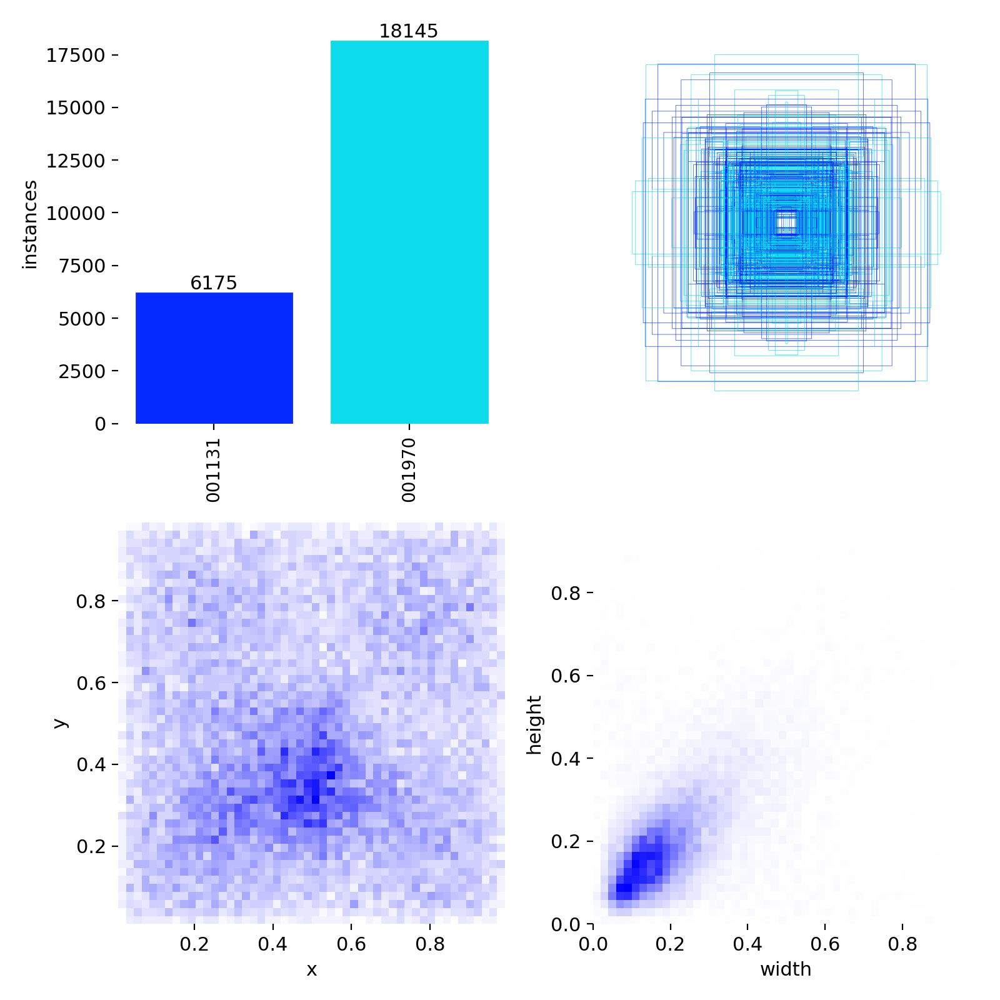
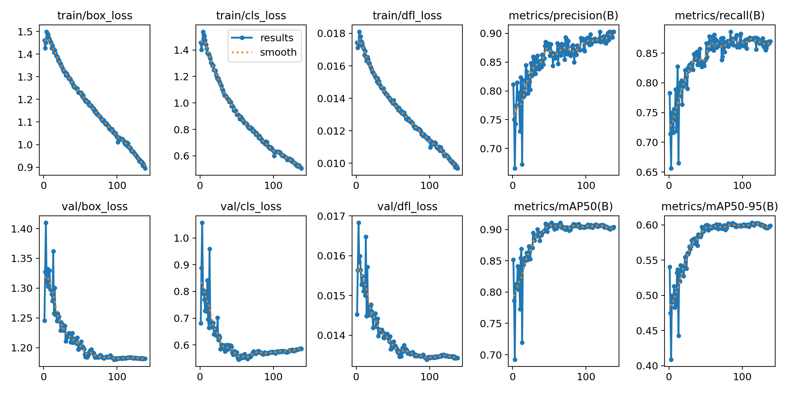
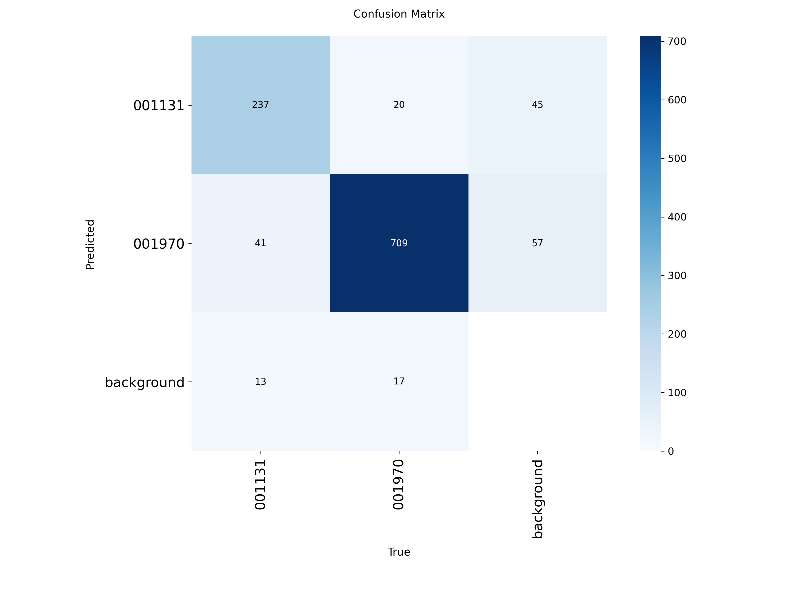
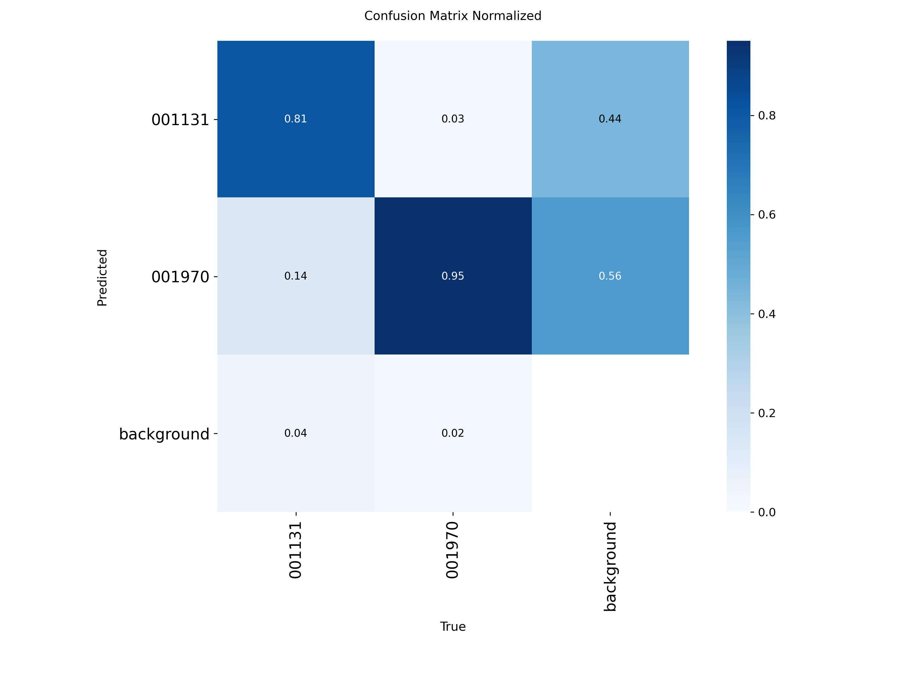

# DeepThyro

Thyroid cancerous nodule detection 


# Setup

run this program Using WSL in case of Windows User

 

```bash
# Create a virtual environment
python3.11 -m venv venv
```
```bash
# Activate virtual environment
source /venv/bin/activate.fish
```

```bash

# Clone repo
cd your-repo
```

```bash
# Install requirements
pip install -r requirements.txt

```


## Pytorch 

NVIDIA GPU


```bash
# NVIDIA GPU
pip3 install torch torchvision --index-url https://download.pytorch.org/whl/cu126 

```

AMD GPU 


```bash
# AMD GPU
pip3 install torch torchvision --index-url https://download.pytorch.org/whl/rocm7.2

```

CPU 

pip3 install torch torchvision --index-url https://download.pytorch.org/whl/cpu
```bash
# CPU
pip3 install torch torchvision --index-url https://download.pytorch.org/whl/cpu

```

MAC
```bash
# MAC
pip3 install torch torchvision

```

## Base models 

YOLO26: https://docs.ultralytics.com/models/yolo26
YOLOv11: https://docs.ultralytics.com/models/yolo11


# DATA 


## Data distribution 

### Labels

 

Data slipt table 70/20/10

Data slipt table with augmentations 


## Data Augmentations 

## Data Pre Processing 


# Best Models Performance 


## YOLO26n
### YOLO26n_1024




YOLO26_1024_PreAugmented-2/confusion_matrix_normalized.png


confusion matrix.png 


confusion matrix normalized.png 



## YOLOv11n

results.png 

confusion matrix.png 

confusion matrix normalized.png 


## Hardware 

### Laptop

CPU INTEL 11th g7 version 

GPU NVIDIA mx450

Memory: 16gb 3200Mhz cl22

OS:  Linux CachyOS


### Desktop

CPU AMD ryzen5 7600X 

GPU AMD Radeon 7800XT

Memory: 32Gb 6400Mhz ddr5 cl32

OS:  Linux CachyOS


