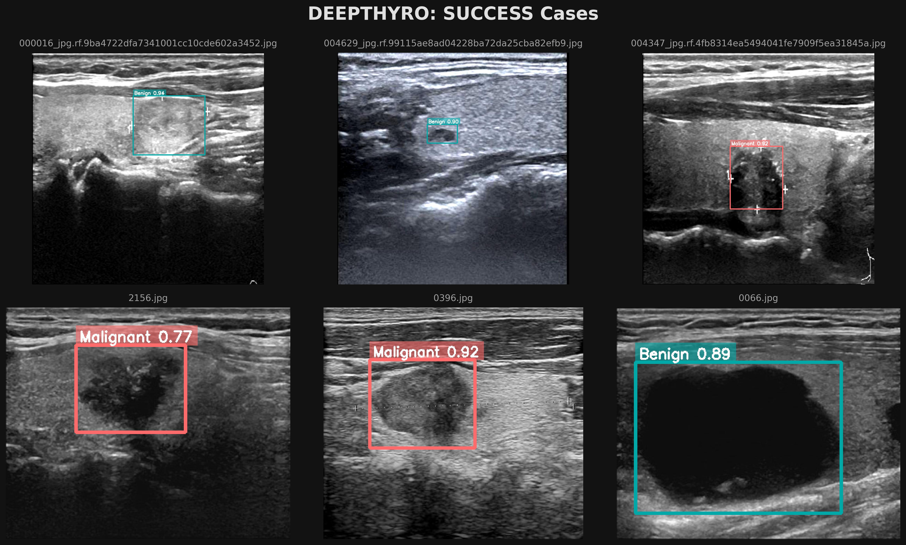

# DeepThyro

Thyroid cancerous nodule detection using a modified version of Yolo26n with 1024*1024 image size using a custom dataset, based on TN500, TG3K, Breast Cancer repository and Custom annotations. The datset is not balanced with heavy bias twoards malignancy, the main objective of this model is to create a effective dettection so it gives a solid foundations to TI-RADS classification models, and segmentation models.
Deepthyro has is different than other implementations because it used the newest model from the YOLO models with a MuSGD optimizer, and utilization of Breast Cancer detection due to similarities in TI-RADS and BI-RADS classification models, and maybe could be the way to have a reliable cancer detection system in ultrasound imaging.


# Results 
## Board: Success Cases

 

# Labels

 


# Best Models Performance 

## YOLO26n
### Results 


### Confusion matrix Normalized


### Confusion matrix Normalized


### Configuration 


# Setup 
## Windows 

run this program Using WSL in case of Windows User


```bash

# Clone repo
cd your-repo
```


```bash
# WSL 
python3.11 -m venv venv
```


```bash
# path to the program 
cd path/to/the/repo 
```

Follow the Linux procedure 


## Linux 
 ```bash

# Clone repo
git clone link to repo 
```

```bash

# Enter the repo
cd path/to/repo
```

```bash
# Create a virtual environment
python3.11 -m venv venv
```
```bash
# Activate virtual environment
source /venv/bin/Activate
```

```bash
# Install requirements
pip install -r requirements.txt
```


## Pytorch 

NVIDIA GPU


```bash
# NVIDIA GPU
pip install torch torchvision torchaudio --index-url [https://download.pytorch.org/whl/cu126](https://download.pytorch.org/whl/cu126)


```

AMD GPU/APU


```bash
# AMD GPU
pip install torch torchvision torchaudio --index-url [https://download.pytorch.org/whl/rocm7.2](https://download.pytorch.org/whl/rocm7.2)

```

Intel GPU

```bash
# Intel 
pip install torch torchvision torchaudio --index-url [https://download.pytorch.org/whl/xpu](https://download.pytorch.org/whl/xpu)

```
MAC
```bash
# MAC
pip install torch torchvision torchaudio

```


CPU 

pip3 install torch torchvision --index-url https://download.pytorch.org/whl/cpu
```bash
# CPU
pip install torch torchvision torchaudio --index-url [https://download.pytorch.org/whl/cpu](https://download.pytorch.org/whl/cpu)

```


## Base models 

**YOLO26:** https://docs.ultralytics.com/models/yolo26 

**YOLOv11:** https://docs.ultralytics.com/models/yolo11


## Datasets
**TN5000:**
**TG3K:**
**Breast Cancer:**

## TI-RADS and BI-RADS 

Table 

## Dataset Distribution 
### Before Augmentations 

table 

## After Augmentations 

table


## Data Augmentations 

## Data Pre Processing 

# Best Models Performance 


## Hardware 

### Laptop

CPU INTEL 11th g7 version 

GPU NVIDIA mx450

Memory: 16gb 3200Mhz cl22

OS:  Linux CachyOS


### Desktop

CPU AMD ryzen5 7600X 

GPU AMD Radeon 7800XT

Memory: 32Gb 6400Mhz ddr5 cl32

OS:  Linux CachyOS


